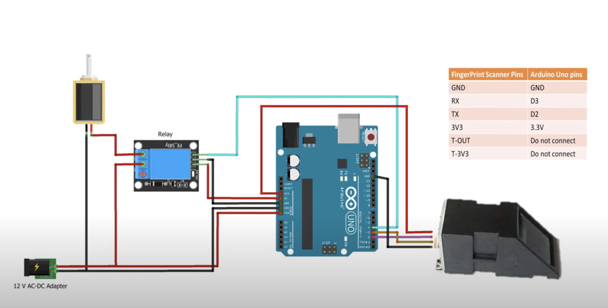
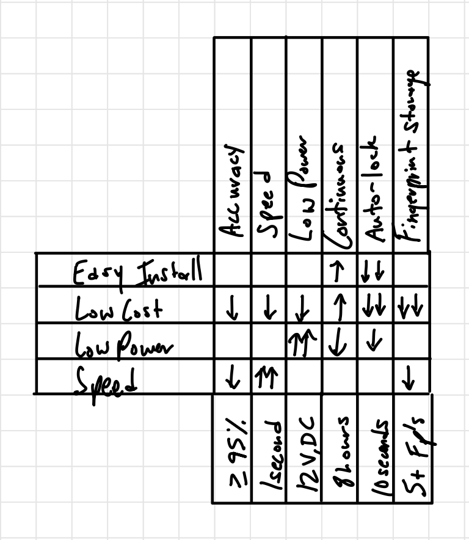
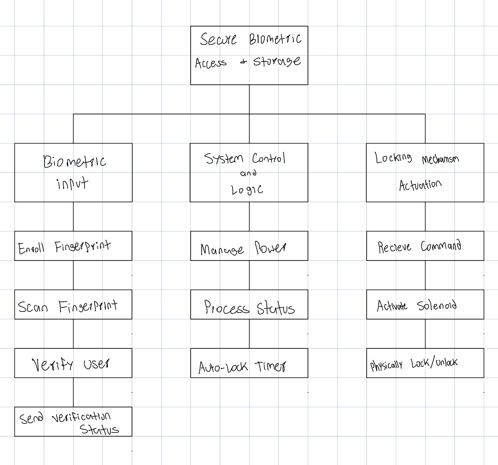
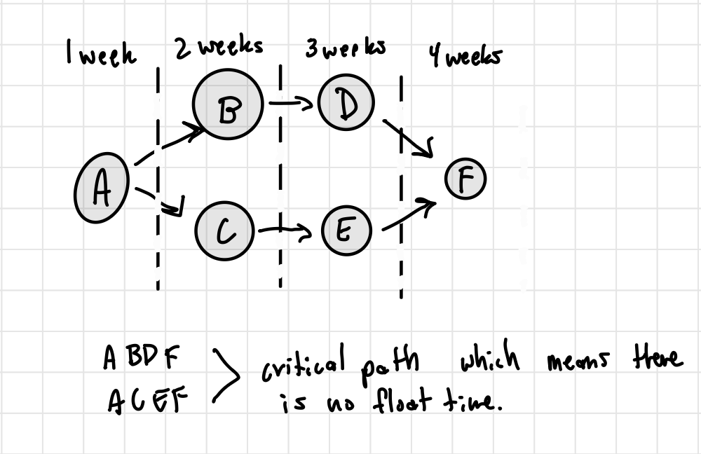
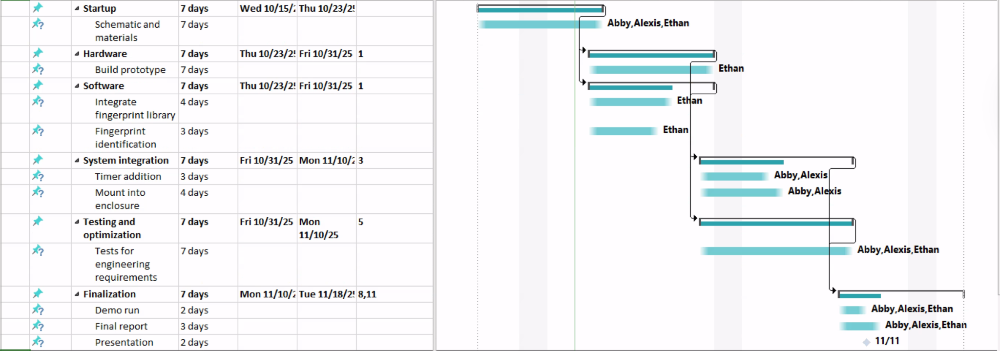

# Biometric Locking Box

A fingerprint-activated locking box built on an Arduino Uno. An optical fingerprint
sensor authenticates the user, and on a successful match the Arduino drives a relay
that releases a locking solenoid.

Traditional safety boxes rely on keys or passcodes that are easy to lose, and
off-the-shelf biometric boxes are expensive. This project is a low-cost alternative
that demonstrates embedded control, sensor integration, and secure storage design.

**Team:** Abigail Duran, Ethan Wells, Alexis Perez

---

## Repository contents

| Path | Description |
| --- | --- |
| `BiometricLockingBox/BiometricLockingBox.ino` | Arduino sketch: matching loop that unlocks the solenoid on a fingerprint match. Adapted from the Adafruit `fingerprint` example. |
| `docs/` | Wiring diagram and project diagrams (see [Wiring](#wiring) and [Project documentation](#project-documentation)). |
| `BIOMETRIC SCANNER BOX (1).pptx` | Full project proposal deck. |
| `LICENSE` | BSD 3-Clause license. |

---

## Hardware

- Arduino Uno
- Optical fingerprint sensor module (Adafruit-compatible, e.g. R305/ZFM-20)
- Relay module
- Locking solenoid
- 12 V DC power supply
- Breadboard and jumper wires
- Enclosure / box

### Wiring



The 12 V adapter powers both the Arduino and the solenoid. The solenoid is switched
through the relay — never driven directly from an Arduino pin — and all grounds are
common.

**Fingerprint sensor → Arduino Uno**

| Sensor pin | Arduino pin |
| --- | --- |
| GND | GND |
| RX | D3 |
| TX | D2 |
| 3V3 | 3.3 V |
| T-OUT | *do not connect* |
| T-3V3 | *do not connect* |

The sketch talks to the sensor over `SoftwareSerial` on D2/D3. On a board with a
spare hardware UART (Leonardo, M0, Mega, etc.) it automatically uses `Serial1`
instead.

**Arduino outputs**

| Arduino pin | Connection |
| --- | --- |
| D4 | Relay control for the locking solenoid (**active LOW**) |
| D8 | Spare output, driven HIGH at boot |
| D13 | Spare output / onboard LED, driven HIGH at boot |

---

## Software

- [Arduino IDE](https://www.arduino.cc/en/software)
- [Adafruit Fingerprint Sensor Library](https://github.com/adafruit/Adafruit-Fingerprint-Sensor-Library)
  (install via **Tools → Manage Libraries… → "Adafruit Fingerprint Sensor Library"**)

### Serial settings

| Port | Baud |
| --- | --- |
| USB serial monitor | 9600 |
| Fingerprint sensor | 57600 |

---

## Getting started

1. Wire the hardware as described above.
2. Install the Adafruit Fingerprint Sensor Library in the Arduino IDE.
3. **Enroll fingerprints first.** This sketch only *matches* against templates
   already stored on the sensor; it does not enroll them. Open
   **File → Examples → Adafruit Fingerprint Sensor Library → enroll**, upload it,
   and follow the serial prompts to store each user's print. The design target is
   at least 5 enrolled fingerprints.
4. Open `BiometricLockingBox/BiometricLockingBox.ino`, select your board and port, and upload.
5. Open the Serial Monitor at **9600 baud**. On boot the sketch prints the sensor
   parameters and the number of stored templates, then waits for a finger.

### Expected serial output

```
Adafruit finger detect test
Found fingerprint sensor!
Reading sensor parameters
Status: 0x0
...
Waiting for valid finger...
Sensor contains 5 templates
Image taken
Image converted
Found a print match!
Found ID #1 with confidence of 142
```

If the sensor is not detected the sketch prints
`Did not find fingerprint sensor :(` and halts — check wiring, the TX/RX swap,
and that the sensor is powered.

---

## How it works

`loop()` calls `getFingerprintID()` every 50 ms:

1. `finger.getImage()` — capture an image. Returns immediately when no finger is present.
2. `finger.image2Tz()` — convert the image into a feature template.
3. `finger.fingerSearch()` — search the stored templates for a match.
4. On a match, pin 4 is pulled **LOW** for 3 seconds to energize the relay and
   release the solenoid, then returned **HIGH** to re-lock.

The unlock window was set to 3 seconds during integration.

Every failure path prints a human-readable reason to the serial monitor
(imaging error, image too messy, communication error, no match, etc.).

`getFingerprintIDez()` is an unused helper from the Adafruit example that performs
the same lookup with `fingerFastSearch()` and no serial chatter.

---

## Design requirements

### User requirements
- Easy to install
- Low cost
- Low power
- Fast

### Engineering requirements
- Correctly identify an enrolled user with **≥95% accuracy**
- Solenoid responds **within 1 second** of verification
- Powered by no more than **12 V DC**
- Operates continuously for at least **8 hours**
- Box re-locks automatically after **10 seconds** of inactivity
- Stores and checks **at least 5 different fingerprints**

---

## Project documentation

Diagrams exported from the project proposal deck.

### QFD chart

User requirements weighed against the engineering requirements that satisfy them.



### Functional decomposition

The system broken into three branches — biometric input, system control and logic,
and locking mechanism actuation.



### Network diagram

Task dependencies across the 5-week schedule. Both **A→B→D→F** and **A→C→E→F** are
critical paths, so there is no float time.



### Gantt chart



### Task list

| Task | Description | Duration |
| --- | --- | --- |
| A | Schematic and bill of materials | 1 week |
| B | Hardware setup, build prototype | 1 week |
| C | Software development, integrate fingerprint library, confirm identification and accuracy | 1 week |
| D | System integration, add timer to locking solenoid, mount into the enclosure | 1 week |
| E | Testing and optimization, run tests to meet all engineering requirements | 1 week |
| F | Finalization, full demo run, prepare final report and rehearse presentation | 1 week |

Total: 35 days (5 weeks).

---

## License

BSD 3-Clause — see [`LICENSE`](LICENSE).

Fingerprint handling is adapted from the Adafruit Fingerprint Sensor Library
example by Limor Fried / Ladyada, Adafruit Industries, which is BSD licensed.
The upstream attribution is retained in the sketch header.
